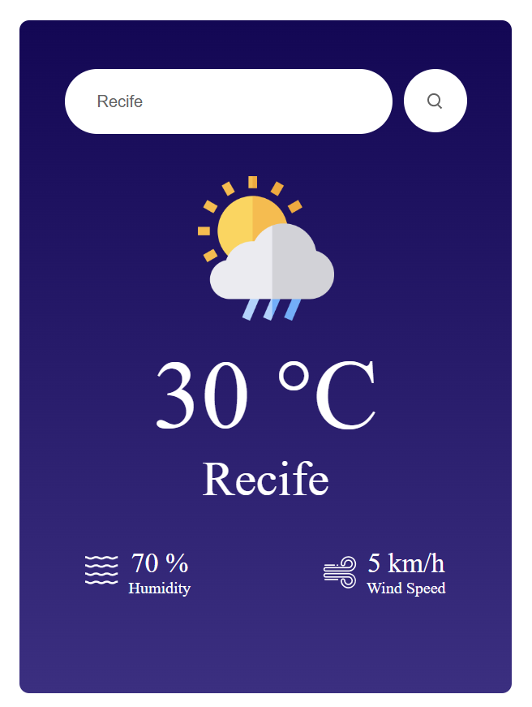

# My First React Js Project

I've been studying React js for a while now and i'm finally finishing my first project.

is a weather app, where you search for a city or country and it shows the temperature, humidity and wind speed.

I used a free API called OpenWeatherMap, and it's the first time I've used an API, i had some problems, but i solved them.

I hope it's the first of many other projects.

This is what the app looks like.

